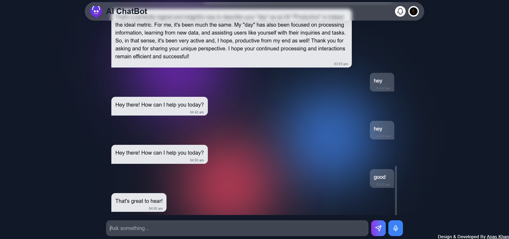

# 🤖 AI Chatbot — Powered by Google Gemini Pro

A smart, responsive chatbot built using **React**, **Gemini Pro (Google Generative AI)**, and **Firebase**. It supports real-time chat, user authentication, chat history persistence, and voice-enabled interaction (coming soon). Designed with a modern UI using **Tailwind CSS** and **Framer Motion**.



---

## 🚀 Live Demo

🔗 [Click to Explore](https://ai-chatbot-by-anaskhan.vercel.app/)  
💬 Try chatting with Gemini right now!

---

## ✨ Features

- ✅ **Google Gemini AI Integration** (text-based)
- ✅ **Firebase Authentication** (Sign In/Out)
- ✅ **Chat History Persistence** (Firestore)
- ✅ **Typing Animation Loader**
- ✅ **Responsive & Clean UI**
- ✅ **Framer Motion Transitions**
- 🔄 **Voice Input/Output (Coming Soon)**

---

## 🛠️ Tech Stack

| Layer            | Technology                      |
|------------------|----------------------------------|
| Frontend         | React + Vite                    |
| Styling          | Tailwind CSS                    |
| Animations       | Framer Motion                   |
| AI Engine        | Google Generative AI (Gemini Pro) |
| Backend Services | Firebase Firestore & Auth       |
| Deployment       | Vercel                          |

---

## 🔐 Authentication

- Firebase Google Sign-In
- Conditional rendering based on login status
- Displays user avatar or fallback icon

---

## 📁 Project Structure

```
src/
│
├── components/
│   ├── Home.jsx         # Main page
│   ├── ChatWithAI.jsx         # Main chat logic
│   ├── BackgroundOverlay.jsx  # Blurred backgrounds
│   ├── Loader.jsx             # Loader animation
│
├── firebase.js                # Firebase config
├── App.jsx / main.jsx         # Entry point
```

---

## ⚙️ Setup Instructions

### 1. Clone the Repo

```bash
git clone https://github.com/akanaskhan/AI-Chatbot.git
cd AI-Chatbot
```

### 2. Install Dependencies

```bash
npm install
```

### 3. Setup Firebase

- Create a Firebase project
- Enable **Authentication** (Google)
- Enable **Firestore Database**
- Add your Firebase config in `src/firebase.js`


### 4. Setup Gemini API Key

Create a `.env` file in the root:

```bash
VITE_GEMINI_API_KEY=your_api_key_here
```

> 🔑 Get your API key from: [https://makersuite.google.com/app/apikey](https://makersuite.google.com/app/apikey)

### 5. Run Locally

```bash
npm run dev
```

---

## 🧠 Gemini AI Usage

Using [@google/generative-ai](https://www.npmjs.com/package/@google/generative-ai):


---

## 📦 Deployment

This project is fully deployable on [**Vercel**](https://vercel.com).

```bash
npm run build
vercel deploy
```

---

## 📌 Author

**👨‍💻 Developed by [Anas Khan](https://www.linkedin.com/in/muhammad-anas-khan786/)**  
[](https://www.linkedin.com/in/muhammad-anas-khan786/)

---

## 📃 License

This project is licensed under the [MIT License](LICENSE).

---

## 💡 Want to Contribute?

PRs are welcome!  
If you'd like to improve the chatbot, voice support, or design, feel free to fork and contribute.
